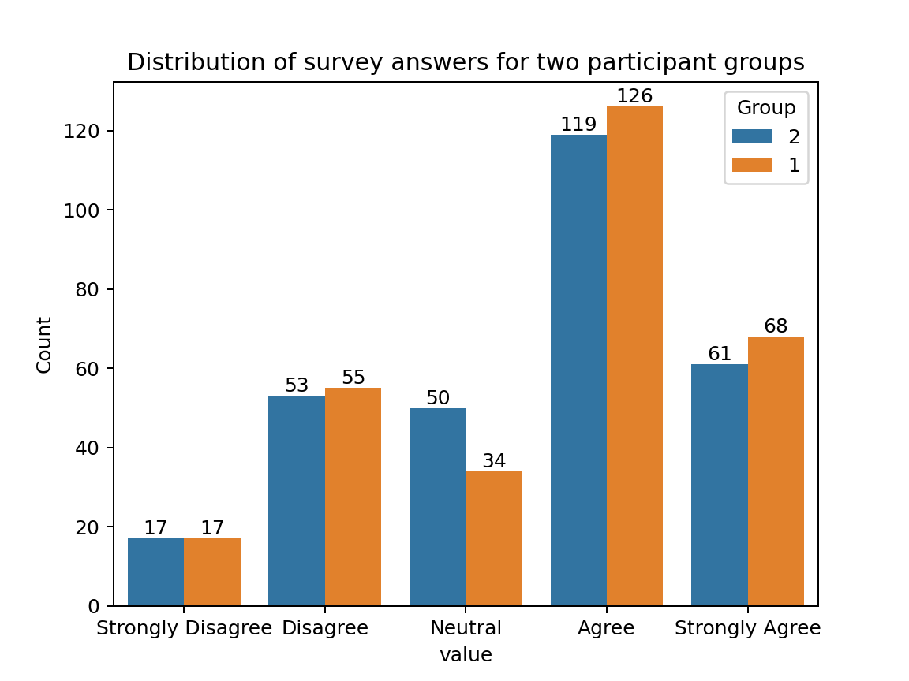

# :jar: :cherries: JAM - Just Ask for Music  
### Multimodal and Personalized Natural Language Music Recommendation


<div align="center">
    
</div>

## Installation & Setup

### Environment

- Install the environment with
  `conda env create -f jam.yml`
- Activate the environment with `conda activate jam`


### Data

- move into the folder of the dataset of your interest
- run the associated notebooks for the pre-processing and splitting
- a folder `processed` should have the following files (/ indicates or):
    - <train/val/test>_split.tsv
    - <user/item>_idxs.tsv
    - <user/item>_<any_modality>_features.npy

### Logging

- JAM uses [W&B](https://wandb.ai/site) for logging. You should create an account there first
- Modify the `constants/wandb_constants.py` file with your `entity_name` and `project_name`
- First time usage you might want call `wandb login` from the shell.


## Usage
General flow is
1. Create a configuration file
2. Call `run_experiments.py`

The framework will take care of:
- Loading the data
- Training/Validating (optionally Testing) the model
- Saving the best model and configuration
- Log results to W&B
### Running a Single Experiment
A single experiments can be 1) `train/val` + `test` 2) `train/val` 3) just `test`

1. Create a `.yml` config file (possibly in `conf/confs/`). See `conf/confs/template_conf.yml` for explanations of the possible values. See `constants/conf_constants.py` for defaults.
   1. Minimally, you should specify `data_path`, where `data/<dataset_name>` is looked for.
   2. Additionally, you should also add hyperparameters of your chosen algorithm.
   3. Running `test` as experiment type requires `model_path` to the saved model.
2. `python run_experiments.py -a <alg> -d <dataset> -c <path_to_conf> -t <run_type>`
   1. For `alg` and `dataset` see the available ones in `constants/enums.py`
   2. `path_to_conf` is what you specified above
   3. For `run_type` and other variables see `run_experiments.py`
3. Look at how your experiment is doing on W&B.

Example:
`test_conf.yml`
```yml
data_path: "./data"
d: 28 # for avgmatching model
device: cuda

n_epochs: 50
eval_batch_size: 256
train_batch_size: 256

running_settings:
  train_n_workers: 4
  eval_n_workers: 4
  batch_verbose: True
```
then run
`python run_experiment.py -a basematching -d amazon23office -c conf/confs/test_conf.yml`
(if `-t` is not specified, it will run `train/val/test`)


### Running Multiple Experiments (Sweeps with W&B)
To run multiple experiments, JAM relies on W&B sweeps. This is to execute different `train/val` experiments.

1. Create a `.yml` config file (possibly in `conf/sweeps/`). Take `conf/sweeps/template_sweep_conf.yml` as reference. See `constants/conf_constants.py` for defaults.
      1. Specify again your `entity_name` and `project_name` in the conf. These are the same values you had for the Logging step above.
      2. Give a meaningful name to your sweep (e.g. `<algorithm_name>-<dataset_name>` should suffice. Add these values to the `parameters` section as well. See `constants/enums.py` for possible values. 
      3. Adjust the rest of the configuration as you please. See the [official docs](https://docs.wandb.ai/guides/sweeps/) on W&B.  
2. Activate the sweep. `wandb sweep conf/sweeps/test_sweep_conf.yml`. Your sweep now should be online and can be monitored on your dashboard.
3. Start 1+ agents. The command to start an agent is returned by wandb when activating the sweep. It's in the shape of `wandb agent <entity_name>/<project_name>/<sweep_id>`.

NB. You can adjust how many gpus are visible to the agent by specifying `CUDA_VISIBLE_DEVICES=... wandb agent..`

#### Multiple Runs on a Server
After activating a sweep, you can use `run_agents.py` to launch multiple agents simultaneously.

When running `run_agent.py` you need to specify:
- `sweep_id`. This value should be in the format `<entity_name>/<project_name>/<sweep_id>`
- `available_gpus` (e.g. the indexes)
- `n_parallel` or how many agents PER gpu. Need to be careful with also the # of workers.
## Extend
### Codebase Structure
```
.
├── algorithms                  <- Classes about Query-User-Item Matching
├── conf                        <- Parsing & Storing .yml conf file
├── constants                   <- Constants & Enums used across the codebase
├── data                        <- Data classes, Raw and Processed Datasets
├── evaluation                  <- Metrics and Evaluation Procedure
├── train                       <- Trainer class
├── utilities                   <- Utilities from mild to low importance
├── (saved_models)              <- Automatically created (if def. conf is not altered)
├── experiment_helper.py        <- Executes the main functionalities of the code.
├── sweep_agent.py              <- Same as experiment_helper but for train_val and when launching sweeps.
├── run_test_sweep.py           <- Same as experiment_helper but for test results over a sweep.
└── run_experiment.py           <- Entry point to the code.
```
### Add Algorithms
Take a look at the `BaseQueryMatchingModel`in `algorithms/base` on what functionalities are expected from a new algorithm.

You can implement your class in `algorithms/alg` (e.g. look at `AverageQueryMatching`). Creating a descendent of `BaseQueryMatchingModel` would be the best ;). 

When the main methods are implemented, add your class to `AlgorithmsEnum` in `constants/enums.py` so it can be recognized when calling `run_experiments`

### Add Datasets
Choose a name, short and lowercase letters to denote the dataset `<dataset_name>`

The expected format of the files are in the first lines in `data/datasets.py` (for the user-query-item matching) and `data/feature.py` (for pre-trained user/item features).

If you can provide the files in the above format, you can add them to ``data/<dataset_name>/processed``

Add your dataset to `DatasetsEnum` in `constants/enums.py`.

NB. Codebase will look for the data in `os.path.join(conf['data_path'],<dataset_name>,'processed')`

# JAMSessions Dataset

Data | Unique # of samples | Field in Dataset | Information 
 --- |---------------------|------------------|-------------|
Query ID | 112,337             | query_idx        |                                        |
Query | 112,337             | text             |
User ID | 103,752             | user_idx         | 
Playlist | 3,978               | item_idxs        | ISRC code of each item in the playlist 

### Statistics

The dataset provides information of 3,978 playlists consisting of 99,865 unique items matched with 112,337 unique queries of 103,752 users.

### Retrieving Metadata of Songs

With the ISRC it is possible to fetch metadata (song title and artist name) of each music track:

```
# Imports
from bs4 import BeautifulSoup
from urllib.request import Request, urlopen
import re


def get_metadata(id_isrc: str):
    # Construct url to retrieve metadata.
    url = f"https://musicbrainz.org/isrc/{id_isrc}"
    
    # Get html page.
    req = Request(url, headers={'User-Agent': 'Mozilla/5.0'})
    html_page = urlopen(req).read()
    soup = BeautifulSoup(html_page, 'html.parser')
    
    # Get data
    song_title = "Undefined"
    artist_name = "Undefined"
    
    try:
        entry = soup.find_all(class_="odd")[0]
        fields = entry.find_all(['td', 'th'])
        data = [cell.get_text(strip=True) for cell in fields]
        song_title = data[0]
        artist_name = data[1]
    except:
        print("Error while retrieving data")
     
    return song_title, artist_name

```

# User Study for Generated Queries

- We also performed a user survey to assess the quality of  300 generated user long queries in a Likert-5 scale (1:Strongly Dissagree, 2:Disagree, 3:Neutral, 4:Agree, 5:Strongly Agree). Each query was evaluated by 2 distinct survey participants.
    
    | Results        |              |
    |---------------|-------:|
    | Unique Participants | 15
    | Total Labels | 600 |
    | Numeric Label (mean / std / median)| 3.54 /  1.17 / 4.0 |
  
-  The mean label value **3.54** indicates a positive perception of the quality of the generated queries.     

- In order to assess the paired agreement of the labels, we performed an statistical significance test between the two groups of labels, namely, a t-test was performed assuming independant (`ttest_ind`) and related (`ttest_rel`) samples.
    |**Test Results**      |`ttest_ind`|`ttest_rel`|
    |-------|:---------:|:---------:|
    |*p-value*| 0.5095|0.3362 |
    |*statistic*|0.6599  |0.9832 |
- With the resulting p-values we are not able to reject the null hypotesis, therefore, the two label groups hold similar distributions.  
<!-- {'total_labels': 600,
 'summary_answers': {'Strongly Disagree': 34,
                     'Disagree': 108,
                     'Neutral': 84,
                     'Agree': 245,
                     'Strongly Agree': 129},
 'numeric_score': {'min': 1,
                   'max': 5,
                   'mean': '3.54',
                   'std': '1.17',
                   'median': '4.0'}} -->


## Cite

If you use this work, please cite our RecSys 2025 paper:

```bibtex
@inproceedings{melchiorre2025jam,
  title     = {Just Ask for Music (JAM): Multimodal and Personalized Natural Language Music Recommendation},
  author    = {Alessandro B. Melchiorre and Elena V. Epure and Shahed Masoudian and Gustavo Escobedo and Anna Hausberger and Manuel Moussallam and Markus Schedl},
  booktitle = {Proceedings of the 19th ACM Conference on Recommender Systems (RecSys)},
  year      = {2025},
  address   = {Prague, Czhech Republic},
  note      = {Short Paper},
  publisher = {ACM},
}
```

## License

The code in this repository is licensed under the MIT License. For details, please see the [LICENSE](./LICENSE) file.


